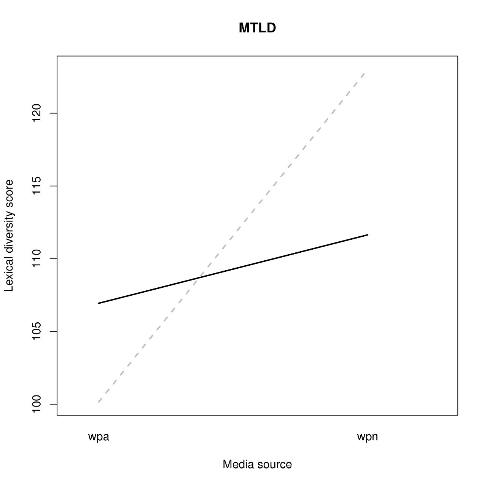
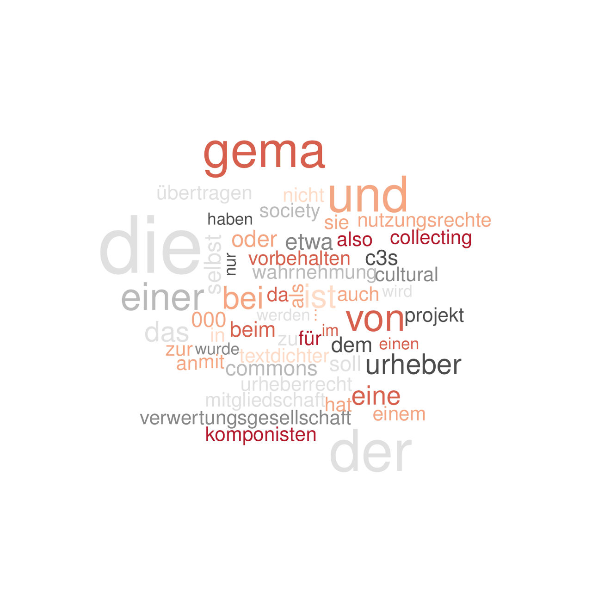

```{r setup, include=FALSE}
header_con <- file("vignette_header.html")
writeLines('<meta name="flattr:id" content="4zdzgd" />', header_con)
close(header_con)
```
<!--
```{r, include=FALSE, cache=FALSE}
# load knitr for better graphics support
library(knitr)
```
-->

# What is tm.plugin.koRpus?
While the `koRpus` package focusses mostly on analysis steps of individual texts, `tm.plugin.koRpus` adds several new object classes and respective methods, which can be used
to analyse complete text corpora in a single step. These classes are also a first step to combine object classes of both, the `koRpus` and `tm` packages.

There are three basic classes, which are hierarchically nested:

1. class `kRp.topicCorpus` holds a list (named by topics) of objects of

2. class `kRp.sourcesCorpus`, which in its `sources` slot holds a list of objects of

3. class `kRp.corpus`, which in turn contains objects of both `koRpus` and `tm` classes.

The idea behind this is to be able to categorize corpora on at least two levels. The default assumes that these levels are different *sources*
and different *topics*, but apart from this naming (which is coded into the classes) you can actually use this for whatever levels you like.

If you don't need these hierarchical levels, you can just use the function `simpleCorpus()` to create objects of class `kRp.corpus`. It simply represents a
collection of texts. To distinguish texts which came from different sources, use the function `sourcesCorpus()`, which will generate sub-corpora for each source
given. And one level higher up, use the function `topicCorpus()`, to sort `kRp.sourcesCorpus` objects by different topics. Objects of this class will
only be valid if there are texts of each topic from each source.

# Tokenizing corpora

As with `koRpus`, the first step for text analysis is tokenizing and possibly POS tagging. This step is performed by the functions mentioned above,
`simpleCorpus()`, `sourcesCorpus()`, or `topicCorpus()`, respectively. The package includes four sample texts taken from
Wikipedia^[see the file `tests/testthat/samples/License\_of\_sample\_texts.txt` for details] in its `tests` directory which
we can use for a demonstration:

```{r, eval=FALSE}
library(tm.plugin.koRpus)
library(koRpus.lang.de)
# set the root path to the sample files
sampleRoot <- file.path(path.package("tm.plugin.koRpus"), "tests", "testthat", "samples")
# now we can define the topics (names of the vector elements)
# and their main path
samplePaths <- c(
  C3S=file.path(sampleRoot, "C3S"),
  GEMA=file.path(sampleRoot, "GEMA")
)
# we also define the sources
sampleSources <- c(
  wpa="Wikipedia_alt",
  wpn="Wikipedia_neu"
)
# and finally, we can tokenize all texts
sampleTexts <- topicCorpus(paths=samplePaths, sources=sampleSources, tagger="tokenize", lang="de")
```

Should you need to get hold of the nested objects inside `kRp.sourcesCorpus` or `kRp.topicCorpus` class objects, or replace them
with updated ones, you can do so by using the methods `corpusTagged()`, `corpusSources()`, or `corpusTopics()`:

```{r, eval=FALSE}
allC3SSources <- corpusSources(corpusTopics(sampleTexts, "C3S"))
names(allC3SSources)
```
```
[1] "wpa" "wpn"
```

Since we're using the `koRpus` package for all actual analysis, you can also setup your environment with `set.kRp.env()` and POS-tag all texts with `TreeTagger`^[see the `koRpus`
documentation for details.].

# Analysing corpora

After the initial tokenizing, we can analyse the corpus by calling the provided methods, for instance lexical diversity:

```{r, eval=FALSE}
sampleTexts <- lex.div(sampleTexts)
corpusSummary(sampleTexts)
```
```
             doc_id topic source stopwords    a    C CTTR   HDD     K lgV0
wpaC3S01   wpaC3S01   C3S    wpa        NA 0.16 0.95 6.13 38.14 49.92 6.21
wpnC3S01   wpnC3S01   C3S    wpn        NA 0.17 0.94 6.82 38.05 54.88 6.10
wpaGEMA01 wpaGEMA01  GEMA    wpa        NA 0.17 0.94 7.07 37.61 65.08 6.11
wpnGEMA01 wpnGEMA01  GEMA    wpn        NA 0.16 0.94 7.13 37.87 60.14 6.24
          MATTR MSTTR   MTLD MTLDMA     R    S  TTR     U
wpaC3S01   0.81  0.79 100.16     NA  8.68 0.93 0.78 39.92
wpnC3S01   0.82  0.76 123.01     NA  9.65 0.92 0.73 36.46
wpaGEMA01  0.80  0.78 106.94    192 10.00 0.92 0.71 35.96
wpnGEMA01  0.81  0.79 111.64     NA 10.08 0.92 0.73 37.47
```

As you can see, `corpusSummary()` returns a `data.frame` object with the summarised results of all
texts below the given object level. That is, if wou are only interested in the results for texts of the first topic,
simply apply `corpusSummary()` on the result of `corpusTopics()`:

```{r, eval=FALSE}
corpusSummary(corpusTopics(sampleTexts, "C3S"))
```
```
           doc_id topic source stopwords    a    C CTTR   HDD     K lgV0 MATTR
wpaC3S01 wpaC3S01   C3S    wpa        NA 0.16 0.95 6.13 38.14 49.92 6.21  0.81
wpnC3S01 wpnC3S01   C3S    wpn        NA 0.17 0.94 6.82 38.05 54.88 6.10  0.82
         MSTTR   MTLD MTLDMA    R    S  TTR     U
wpaC3S01  0.79 100.16     NA 8.68 0.93 0.78 39.92
wpnC3S01  0.76 123.01     NA 9.65 0.92 0.73 36.46
```

There are quite a number of `corpus*()` getter/setter methods for slots of these objects, e.g.,
`corpusReadability()` to get the `readability()` results from objects of class `kRp.corpus`.

As we explained earlier, the nested S4 object classes used by `tm.plugin.koRpus` are rather complex.
Two methods can be especially helpful for further analysis. The first one is `tif_as_tokens_df()` and returns
a `data.frame` including all texts of the tokenized corpus in a format that is compatible with
[Text Interchange Formats](https://github.com/ropensci/tif) standards.

The second one is a family of `[`, `[<-`, `[[` and `[[<-` shorcuts to directly interact with the
`data.frame` object you get via `corpusSummary()`. Here's an example how to use this to plot interactions:

```{r, eval=FALSE}
library(sciplot)
lineplot.CI(
  x.factor=sampleTexts[["source"]],
  response=sampleTexts[["MTLD"]],
  group=sampleTexts[["topic"]],
  type="l",
  main="MTLD",
  xlab="Media source",
  ylab="Lexical diversity score",
  col=c("grey", "black"),
  lwd=2
)
```
<figure>
  
  <figcaption>Well, the example texts aren't so impressive here, as there's not much variance in one text per source and topic.</figcaption>
</figure>

## Frequency analysis

The object classes make it quite comfortable to analyse type frequencies of corpora. There is a method
`read.corp.custom()` for these classes, that will do this analysis recursively on all levels:

```{r, eval=FALSE}
sampleTexts <- read.corp.custom(sampleTexts, caseSens=FALSE)
sampleTextsWordFreq <- query(
  corpusFreq(sampleTexts),
  var="wclass",
  query=kRp.POS.tags(lang="de", list.classes=TRUE, tags="words")
)
head(sampleTextsWordFreq, 10)
```
```
   num    word lemma      tag wclass lttr freq         pct  pmio    log10
3    3     die       word.kRp   word    3   30 0.037220844 37220 4.570776
4    4     der       word.kRp   word    3   21 0.026054591 26054 4.415874
5    5    gema       word.kRp   word    4   17 0.021091811 21091 4.324097
6    6     und       word.kRp   word    3   17 0.021091811 21091 4.324097
7    7   einer       word.kRp   word    5   12 0.014888337 14888 4.172836
8    8     von       word.kRp   word    3   12 0.014888337 14888 4.172836
11  11     ist       word.kRp   word    3   10 0.012406948 12406 4.093632
12  12     bei       word.kRp   word    3    9 0.011166253 11166 4.047898
13  13     das       word.kRp   word    3    8 0.009925558  9925 3.996731
14  14 urheber       word.kRp   word    7    8 0.009925558  9925 3.996731
   rank.avg rank.min rank.rel.avg rank.rel.min inDocs               idf
3     263.0      263     99.24528     99.24528      4                 0
4     262.0      262     98.86792     98.86792      4                 0
5     260.5      260     98.30189     98.11321      4                 0
6     260.5      260     98.30189     98.11321      4                 0
7     258.5      258     97.54717     97.35849      4                 0
8     258.5      258     97.54717     97.35849      4                 0
11    256.0      255     96.60377     96.22642      4                 0
12    254.0      254     95.84906     95.84906      4                 0
13    252.5      252     95.28302     95.09434      4                 0
14    252.5      252     95.28302     95.09434      2 0.301029995663981
```

In combination with the `wordcloud` package, this can directly be used to plot
word clouds:

```{r, eval=FALSE}
require(wordcloud)
colors <- brewer.pal(8, "RdGy")
wordcloud(
  head(sampleTextsWordFreq[["word"]], 200),
  head(sampleTextsWordFreq[["freq"]], 200),
  random.color=TRUE,
  colors=colors
)
```
<figure>
  
  <figcaption>The 200 most frequent words in the example corpus</figcaption>
</figure>

<!--  # Reference -->
