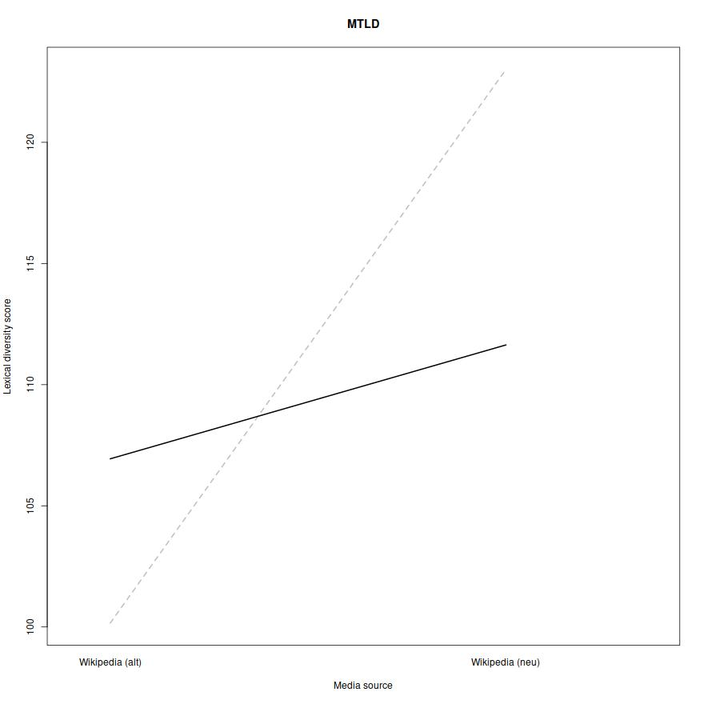

```{r setup, include=FALSE}
header_con <- file("vignette_header.html")
writeLines('<meta name="flattr:id" content="4zdzgd" />', header_con)
close(header_con)
```
<!--
```{r, include=FALSE, cache=FALSE}
# load knitr for better graphics support
library(knitr)
```
-->

# What is tm.plugin.koRpus?
While the `koRpus` package focusses mostly on analysis steps of individual texts, `tm.plugin.koRpus` adds several new object classes and respective methods, which can be used
to analyse complete text corpora in a single step. These classes are also a first step to combine object classes of both, the `koRpus` and `tm` packages.

At the core of this package there is one particular object class -- `kRp.hierarchy` -- which can be used to construct hierarchically nested object trees.
That is, you are able to categorize corpora on as many levels as you need. The examples in this vignette use two levels, one being different *topics* the texts
in the sample corpus deal with, and the other different *sources* the texts come from.

If you don't need these hierarchical levels, you can just use the function `readCorpus()` to create a corpus object. It simply represents a
collection of texts. To distinguish texts which came from different sources or deal with different topics, use the `hierarchy` argument, which will generate sub-corpora for each source
and topic given. These objects will only be valid if there are texts of each topic from each source.

Now, if this still confuses you, let's look at a small example.

# Tokenizing corpora

As with `koRpus`, the first step for text analysis is tokenizing and possibly POS tagging. This step is performed by the `readCorpus()` function mentioned above.
The package includes four sample texts taken from Wikipedia^[See the file `tests/testthat/samples/License\_of\_sample\_texts.txt` for details] in its `tests` directory which
we can use for a demonstration:

```{r, eval=FALSE}
library(tm.plugin.koRpus)
library(koRpus.lang.de)
# set the root path to the sample files
sampleRoot <- file.path(path.package("tm.plugin.koRpus"), "tests", "testthat", "samples")
# the next call uses "hierarchy" to describe the directory structure
# and its meaning; see below
sampleTexts <- readCorpus(
  dir=sampleRoot,
  hierarchy=list(
    Topic=c(
      C3S="C3S SCE",
      GEMA="GEMA e.V."
    ),
    Source=c(
      Wikipedia_alt="Wikipedia (alt)",
      Wikipedia_neu="Wikipedia (neu)"
    )
  ),
  tagger="tokenize",
  lang="de"
)
```
```
processing corpus 
  Topic "C3S SCE"
    Source "Wikipedia (alt)", 1 text...
    Source "Wikipedia (neu)", 1 text...
  Topic "GEMA e.V."
    Source "Wikipedia (alt)", 1 text...
    Source "Wikipedia (neu)", 1 text...
```

## The `hierarchy` argument

The `hierarchy` argument describes our corpus in a very condensed format. It is a named list of named character vectors,
where each list entry represents a hierarchical level. In this case, the top level is called *"Topics"*, below that is the
level *"Source"*. These hierachical levels must also be represented by the directory structure of the texts to parse,
and the *names* of the character vectors must be identical to the *directory names* below the root directory specified by `dir`.^[
Future versions of this package might add furter ways of describing your corpus, like using a configuration file or providing
a full corpus in XML or JSON format.]

So on your file system, what the `hierarchy` argument above describes is the following layout:

```
.../samples/
  C3S/
    Wikipedia_alt/
      Text01.txt
      Text02.txt
      ...
    Wikipedia_neu/
      Text03.txt
      Text04.txt
      ...
  GEMA/
    Wikipedia_alt/
      Text05.txt
      Text06.txt
      ...
    Wikipedia_neu/
      Text07.txt
      Text08.txt
      ...
```

<!--
Should you need to get hold of the nested objects inside `kRp.sourcesCorpus` or `kRp.topicCorpus` class objects, or replace them
with updated ones, you can do so by using the methods `corpusTagged()`, `corpusSources()`, or `corpusTopics()`:

```{r, eval=FALSE}
allC3SSources <- corpusSources(corpusTopics(sampleTexts, "C3S"))
names(allC3SSources)
```
```
[1] "wpa" "wpn"
```
-->

Since we're using the `koRpus` package for all actual analysis, you can also setup your environment with `set.kRp.env()` and POS-tag all texts with `TreeTagger`^[see the `koRpus`
documentation for details.].

# Analysing corpora

After the initial tokenizing, we can analyse the corpus by calling the provided methods, for instance lexical diversity:

```{r, eval=FALSE}
sampleTexts <- lex.div(sampleTexts)
corpusSummary(sampleTexts)
```
```
                    corpus     Topic          Source              doc_id
C3SWikipedia_alt01           C3S SCE Wikipedia (alt)  C3SWikipedia_alt01
C3SWikipedia_neu01           C3S SCE Wikipedia (neu)  C3SWikipedia_neu01
GEMAWikipedia_alt01        GEMA e.V. Wikipedia (alt) GEMAWikipedia_alt01
GEMAWikipedia_neu01        GEMA e.V. Wikipedia (neu) GEMAWikipedia_neu01
                    stopwords    a    C CTTR   HDD     K lgV0 MATTR MSTTR
C3SWikipedia_alt01         NA 0.16 0.95 6.13 38.14 49.92 6.21  0.81  0.79
C3SWikipedia_neu01         NA 0.17 0.94 6.82 38.05 54.88 6.10  0.82  0.76
GEMAWikipedia_alt01        NA 0.17 0.94 7.07 37.61 65.08 6.11  0.80  0.78
GEMAWikipedia_neu01        NA 0.16 0.94 7.13 37.87 60.14 6.24  0.81  0.79
                      MTLD MTLDMA     R    S  TTR     U
C3SWikipedia_alt01  100.16     NA  8.68 0.93 0.78 39.92
C3SWikipedia_neu01  123.01     NA  9.65 0.92 0.73 36.46
GEMAWikipedia_alt01 106.94    192 10.00 0.92 0.71 35.96
GEMAWikipedia_neu01 111.64     NA 10.08 0.92 0.73 37.47
```

As you can see, `corpusSummary()` returns a `data.frame` object with the summarised results of all
texts.

There are quite a number of `corpus*()` getter/setter methods for slots of these objects, e.g.,
`corpusReadability()` to get the `readability()` results from objects of class `kRp.hierarchy`.

As we explained earlier, the nested S4 object classes used by `tm.plugin.koRpus` are rather complex.
Two methods can be especially helpful for further analysis. The first one is `tif_as_tokens_df()` and returns
a `data.frame` including all texts of the tokenized corpus in a format that is compatible with
[Text Interchange Formats](https://github.com/ropensci/tif) standards.

The second one is a family of `[`, `[<-`, `[[` and `[[<-` shorcuts to directly interact with the
`data.frame` object you get via `corpusSummary()`. Here's an example how to use this to plot interactions:

```{r, eval=FALSE}
library(sciplot)
lineplot.CI(
  x.factor=sampleTexts[["Source"]],
  response=sampleTexts[["MTLD"]],
  group=sampleTexts[["Topic"]],
  type="l",
  main="MTLD",
  xlab="Media source",
  ylab="Lexical diversity score",
  col=c("grey", "black"),
  lwd=2
)
```
<figure>
  
  <figcaption>Well, the example texts aren't so impressive here, as there's not much variance in one text per source and topic.</figcaption>
</figure>

## Frequency analysis

The object classes make it quite comfortable to analyse type frequencies of corpora. There is a method
`read.corp.custom()` for these classes, that will do this analysis recursively on all levels:

```{r, eval=FALSE}
sampleTexts <- read.corp.custom(sampleTexts, caseSens=FALSE)
sampleTextsWordFreq <- query(
  corpusFreq(sampleTexts)[["corpus"]],
  var="wclass",
  query=kRp.POS.tags(lang="de", list.classes=TRUE, tags="words")
)
head(sampleTextsWordFreq, 10)
```
```
   num    word lemma      tag wclass lttr freq         pct  pmio    log10
3    3     die       word.kRp   word    3   30 0.037220844 37220 4.570776
4    4     der       word.kRp   word    3   21 0.026054591 26054 4.415874
5    5    gema       word.kRp   word    4   17 0.021091811 21091 4.324097
6    6     und       word.kRp   word    3   17 0.021091811 21091 4.324097
7    7   einer       word.kRp   word    5   12 0.014888337 14888 4.172836
8    8     von       word.kRp   word    3   12 0.014888337 14888 4.172836
11  11     ist       word.kRp   word    3   10 0.012406948 12406 4.093632
12  12     bei       word.kRp   word    3    9 0.011166253 11166 4.047898
13  13     das       word.kRp   word    3    8 0.009925558  9925 3.996731
14  14 urheber       word.kRp   word    7    8 0.009925558  9925 3.996731
   rank.avg rank.min rank.rel.avg rank.rel.min inDocs               idf
3     263.0      263     99.24528     99.24528      4                 0
4     262.0      262     98.86792     98.86792      4                 0
5     260.5      260     98.30189     98.11321      4                 0
6     260.5      260     98.30189     98.11321      4                 0
7     258.5      258     97.54717     97.35849      4                 0
8     258.5      258     97.54717     97.35849      4                 0
11    256.0      255     96.60377     96.22642      4                 0
12    254.0      254     95.84906     95.84906      4                 0
13    252.5      252     95.28302     95.09434      4                 0
14    252.5      252     95.28302     95.09434      2 0.301029995663981
```

In combination with the `wordcloud` package, this can directly be used to plot
word clouds:

```{r, eval=FALSE}
require(wordcloud)
colors <- brewer.pal(8, "RdGy")
wordcloud(
  head(sampleTextsWordFreq[["word"]], 200),
  head(sampleTextsWordFreq[["freq"]], 200),
  random.color=TRUE,
  colors=colors
)
```
<figure>
  
  <figcaption>The 200 most frequent words in the example corpus</figcaption>
</figure>

<!--  # Reference -->
